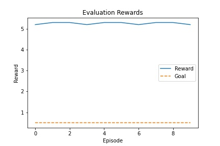

# Report

For the implementation a modified version of **DDPG** algorithm was chosen.
The implementation follows the original paper with some deviations described below.

## Networks

The [paper](https://arxiv.org/abs/1509.02971) uses 4 networks are used. 2 for Critics and 2 for Actors. For this multi-agent task each agent uses its own online and target networks. Critics networks shared across all agents. Every 20 time-steps Actor networks are updated 6 times.
Final solution uses 6 networks in total: 2 per agent and 2 shared for Critics implementation. 

### Architecture

All networks use similar architectures. Deviations are in the layer size. Since Critics network is shared and represents main part of Loss calculation, it has more neurons. Actor network has `tanh` activation function on the output layer to set values between -1 and 1.
As per paper Linear layers are adjusted with batch normalization - in `pytorch` terms - LayerNorm.
Initial weights and biases set to standard deviation.

```python
Actor(
  (fc1): Linear(in_features=24, out_features=300, bias=True)
  (bn1): LayerNorm((300,), eps=1e-05, elementwise_affine=True)
  (hidden): ModuleList(
    (0): Linear(in_features=300, out_features=400, bias=True)
  )
  (hidden_norm): ModuleList(
    (0): LayerNorm((400,), eps=1e-05, elementwise_affine=True)
  )
  (out): Linear(in_features=400, out_features=2, bias=True)
)
```

```python
Critic(
  (fc1): Linear(in_features=26, out_features=400, bias=True)
  (bn1): LayerNorm((400,), eps=1e-05, elementwise_affine=True)
  (hidden): ModuleList(
    (0): Linear(in_features=400, out_features=500, bias=True)
  )
  (hidden_norm): ModuleList(
    (0): LayerNorm((500,), eps=1e-05, elementwise_affine=True)
  )
  (out): Linear(in_features=500, out_features=2, bias=True)
)
```

To insure IID (independent and identically distributed) principal - Replay Buffer was used. Experiences were randomly sampled from it.

During implementation it was clear that default parameters lack initial exploration that lead to updating OU Noise process with more aggressive [parameters](#hyperparameters)
Overall DDPG showed good and stable performance

#### Training


#### Evaluation results



## Hyperparameters

All parameters were taken from the paper with no change.

$\gamma=0.98$

$\tau=1e-2$

$\alpha_{actor}=1e-4$ - Actor learning rate

$\alpha_{critic}=1e-3$ - Critic learning rate

Ornstein-Uhlenbeck Process

$\mu=0.0$

$\theta=0.25$

$\sigma_{max}=0.4$

$\sigma_{min}=0.1$

$p_{decay}=500$ - decay period

Replay Buffer

$size=500000$

## Further improvements

Current solution showed good performance and was able to reach the solution in 568 episodes. Despite that, rewards have stochastic nature. It can be fixed by [Prioritized Replay Buffer](https://arxiv.org/abs/1511.05952) and/or by introducing a [baseline](https://arxiv.org/abs/2003.10181).
