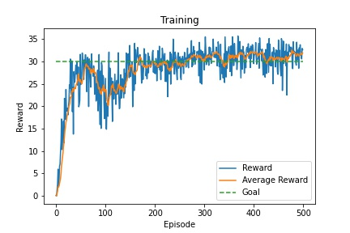
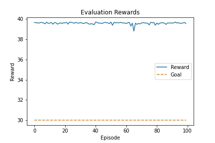
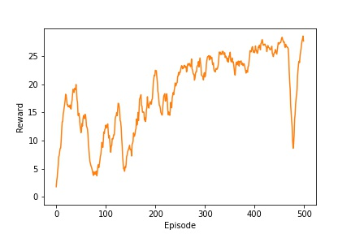
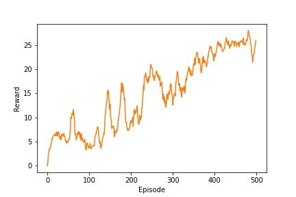
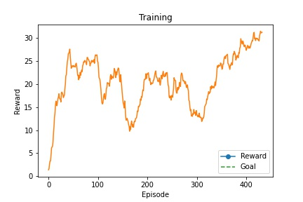
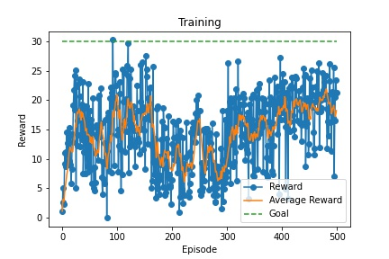

# Report

For the implementation **DDPG** algorithm was chosen.
The implementation follows the original paper with some deviations described below in [Experiments](#Experiments).

## Networks

As the [paper](https://arxiv.org/abs/1509.02971) suggests 4 networks are used. 2 for Critics and 2 for Actors.
Final solution uses Actor and Critic network to update their target networks every 20 time-steps. Update routine was repeated 15 times on each iteration.

### Architecture

Both network contain exactly the same architecture, just the Actor network has `tanh` activation function on the output layer to set values between -1 and 1.
As per paper Linear layers are adjusted with batch normalization - in `pytorch` terms - LayerNorm.
Initial weights and biases set to standard deviation.

```python
Actor(
  (fc1): Linear(in_features=33, out_features=300, bias=True)
  (bn1): LayerNorm((300,), eps=1e-05, elementwise_affine=True)
  (hidden_layers): ModuleList(
    (0): Linear(in_features=300, out_features=400, bias=True)
  )
  (hidden_norms): ModuleList(
    (0): LayerNorm((400,), eps=1e-05, elementwise_affine=True)
  )
  (output): Linear(in_features=400, out_features=4, bias=True)
)
```

```python
Critic(
  (fc1): Linear(in_features=37, out_features=300, bias=True)
  (bn1): LayerNorm((300,), eps=1e-05, elementwise_affine=True)
  (hidden_layers): ModuleList(
    (0): Linear(in_features=300, out_features=400, bias=True)
  )
  (hidden_norms): ModuleList(
    (0): LayerNorm((400,), eps=1e-05, elementwise_affine=True)
  )
  (output): Linear(in_features=400, out_features=4, bias=True)
)
```

To insure IID (independent and identically distributed) principal - Replay Buffer was used. Experiences were randomly sampled from it.

In various experiments the buffer was pre-filled by non zero reward experiences obtained by the Random Agent. This approach is not suitable for all environments in particular for those with large state space size. Despite that - in this environment it showed fast start. Personally, consider it as a dummy way of transfer learning - when the agent was shown to external experiences.

2 Approaches were taken to update network.

1. More aggressive network parameters Soft update. Different $\tau$ parameters were used as well as number of updates per step was used. For instance updating network parameters 20 times per time-step showed stable performance growth - Experiment 2.
2. Updating Networks every N time-steps for M times. - Which was used in the last solution

Overall DDPG showed good and stable performance

#### Training



#### Evaluation results



## Hyperparameters

All parameters were taken from the paper with no change.

$\gamma=0.99$

$\tau=1e-2$

$\alpha_{actor}=1e-4$ - Actor learning rate

$\alpha_{critic}=1e-3$ - Critic learning rate

Ornstein-Uhlenbeck Process

$\mu=0.0$

$\theta=0.15$

$\sigma_{max}=0.3$

$\sigma_{min}=0.1$

$p_{decay}=100000$ - decay period

Replay Buffer

$size=500000$

## Experiments

### Experiment 1

#### Parameters

- Batch size 256
- Pre-filled buffer length about 5000 experiences
- Steps $500*10^3$
- Aggressive Soft update with factor 5

> Result - No solution in 500 episodes
  


### Experiment 2

#### Parameters

- Batch size 256
- Pre-filled buffer length about 5000 experiences
- Steps $500*10^3$
- Aggressive Soft update with factor 10

> Result - No solution in 500 episodes

  

### Experiment 3

#### Parameters

- Batch size 256
- Pre-filled buffer length about 5000 experiences
- Steps $1.5*10^6$
- Regular Soft update

> Result - Converged in less than 500 episodes.
> !!! **Could not reproduce in consequent runs**
  


### Experiment 4

#### Parameters

- Batch size 256
- No pre-filled Replay Buffer
- Steps $1.5*10^6$
- Regular Soft update

> Result - No solution in 1500 episodes



### Experiment 5

#### Parameters

- Batch size 256
- Pre-filled buffer length about 5000 experiences
- Steps $500*10^3$
- Regular Soft update
- Critic's gradient clipping was applied



### Experiment 6

#### Parameters

- Batch size 64
- Pre-filled buffer length about 5000 experiences
- Steps $500*10^3$
- Update networks 15 times every 20 steps
- Critic's gradient clipping was applied


#### Evaluation results


## Further improvements

The agent can benefit from an environment with multiple agents. There are 2 possible improvements.
First, shared Replay Buffer can be used. That would require minimum changes in the current implementation. DDPG still can be used.
Different algorithms, especially those for multiple agents can be used. There is some interest in D4PG for such case.

Current solution supposed to have an early stop within 500 episodes. Unfortunately it was achieved only once and never been reproduced after. Addressing long training would be the first step. While experimenting, it was shown that smaller batch size (64) converges faster, that may signify that the current Network architecture struggles to optimize the function. Larger network may have different results.
